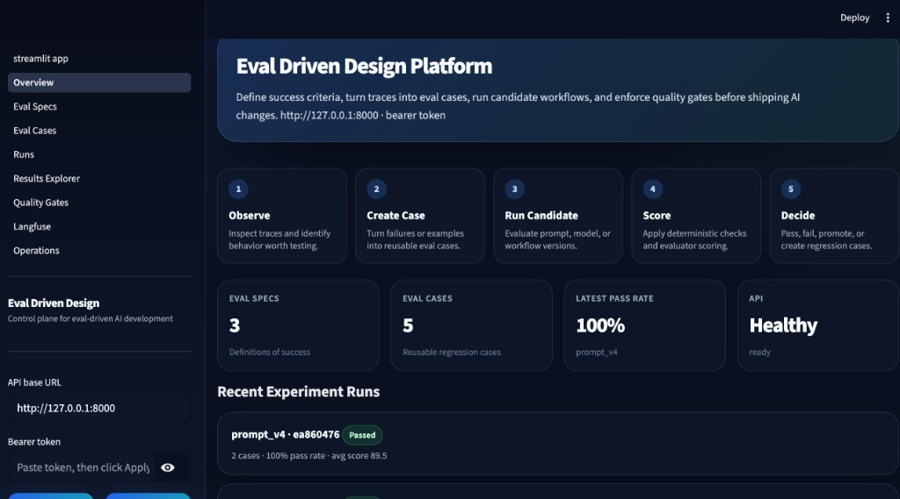
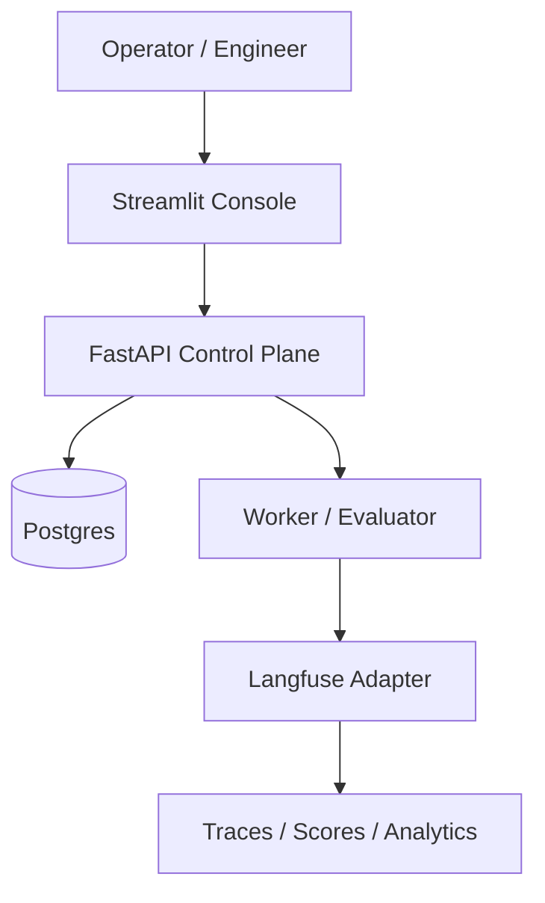

# Eval Driven Design Platform

A clean-room **control plane for eval-driven AI development** on top of [Langfuse](https://langfuse.com).

The platform shows how teams can define success criteria, turn observed failures into
reusable eval cases, run candidate prompts/models/workflows, push scores back to
Langfuse, and enforce quality gates before shipping AI changes.

**This project does not replace Langfuse.** Langfuse remains the observability and evaluation data plane. EDD provides the engineering workflow around it.

You can run the stack locally to walk through the operator loop end to end, with optional Langfuse integration.

## Console

Streamlit operator UI — Observe → Case → Run → Evaluate → Decide:



## Why this exists

AI teams often discover failures through traces, logs, support escalations, or manual testing, but those failures do not automatically become reusable engineering assets.

This project explores an **eval-driven design** workflow where:

- observed failures become **eval cases**
- eval cases become **repeatable experiments**
- experiment results become **quality gates** before AI changes ship

## What this demonstrates

- Evaluation-driven design for AI workflows
- Turning observed failures into reusable eval cases (including Langfuse trace import)
- Separating eval specs, cases, experiment runs, and quality gates
- Using observability and traces as part of the development loop
- Treating AI behavior as measurable and testable before release (deterministic mock evaluator today)
- Designing a lightweight platform / control-plane abstraction around Langfuse
- Monorepo hygiene: FastAPI, Streamlit, Postgres, Docker/Kubernetes scaffolding, and CI checks

## Architecture



**Today:** experiment scaffold and mock evaluation run **in the API**; the worker image
provides logging, OTel, and deploy parity. Async worker-backed runs are planned. The
Langfuse adapter is invoked from the API when integration is enabled.

## Demo flow

1. **Define an EvalSpec** — what success means (rubric, pass threshold).
2. **Add EvalCases** — manually or by importing a Langfuse trace.
3. **Run an ExperimentRun** — against a candidate version (e.g. `prompt_v4`).
4. **Review results** — scores, justifications, and Langfuse trace links in the console.
5. **Iterate** — adjust the candidate or cases and re-run.
6. **Quality gate** — `./scripts/run_quality_gate.sh` or **Quality Gates** page in the console.

With Langfuse enabled (`./scripts/local_e2e.sh --postgres --langfuse`), runs can create traces and push scores when integration is configured.

External producers (e.g. `edd-agent-lab`) publish runs via `POST /v1/integrations/runs/publish`; gate and provenance are stored on the experiment run.

## What you get (target MVP)

- **EvalSpec** — what “good” means (rubric, thresholds, judge config)
- **EvalCase** — reusable cases (manual or imported from Langfuse traces)
- **ExperimentRun** — compare candidates (`prompt_v3` vs `prompt_v4`)
- **Quality gates** — unified gate API, console page, and CI script
- **External run ingest** — generic publish endpoint with provenance on runs
- **Streamlit console** — Observe → Case → Run → Evaluate → Decide
- **Langfuse adapter** — health, trace fetch, import case, score push, trace create on run

## Current status

### Implemented

- Monorepo: `api/`, `console/`, `worker/`, `deploy/`, `scripts/`
- FastAPI control plane: health, ready, metrics, demo JWT auth, tenant-scoped APIs
- **EvalSpec** and **EvalCase** CRUD (Postgres and in-memory storage)
- **ExperimentRun** API with deterministic mock scaffold and mock evaluator
- Run summaries, **evaluation results**, and **quality gate** evaluation
- **External run ingest** (`POST /v1/integrations/runs/publish`) with persisted provenance
- Streamlit console: Overview, Eval Specs, Cases, Runs, Results Explorer, Quality Gates, Langfuse, Operations
- Optional **Langfuse**: health, get trace, import case, push scores, create trace on run
- Local dev: `local_e2e.sh`, seed script, Docker images, Helm skeleton
- CI: tests, Ruff, mypy, OpenAPI drift, pip-audit, Dockerfile policy, image builds, kubeconform

### Remaining (MVP polish)

See **`docs/HLD_TEST_FIRST_IMPLEMENTATION.md`** — Phases 9–12 complete; 13b in progress. Remaining MVP polish: README diagram (HLD-009) and Helm.

| Phase | Scope | Status |
|-------|--------|--------|
| 0–8 | Platform MVP spine (EvalSpec, runs, gates, ingest) | Done |
| 9–12 | Contract CI, HLD domain, tool feasibility, evidence loop | Done |
| 13 | Reference scenario demo + lifecycle console | In progress (13b) |
| 14 | Operational mode | Deferred |

**Demo walkthrough:** `docs/DEMO_SCRIPT.md` · **CI gate:** `docs/QUALITY_GATE_CI.md`

## High-level design (HLD)

Architecture and MVP implementation for the **EDD stack** (**eval-driven-design-platform** + **edd-agent-lab**):

- [HLD index](docs/hld/README.md)
- [HLD-001: Product intent and system boundaries](docs/hld/HLD-001-product-intent-and-system-boundaries.md)
- [HLD-002: Domain object model](docs/hld/HLD-002-domain-object-model.md)
- [HLD-003: Evaluation-driven design workflow](docs/hld/HLD-003-evaluation-driven-design-workflow.md)
- [HLD-004: Tool requirements and feasibility](docs/hld/HLD-004-tool-requirements-and-feasibility.md)
- [HLD-005: Reference scenario — Customer Escalation Triage](docs/hld/HLD-005-reference-scenario-customer-escalation-triage.md)
- [HLD-006: MVP implementation plan](docs/hld/HLD-006-mvp-implementation-plan.md)
- [HLD-007: Platform API and integration](docs/hld/HLD-007-platform-api-and-integration.md)
- [HLD-008: Langfuse integration](docs/hld/HLD-008-langfuse-integration.md)
- [HLD-009: Architecture and flow diagrams](docs/hld/HLD-009-architecture-and-flow-diagrams.md)
- [HLD-010: Graph design and rule mapping](docs/hld/HLD-010-graph-design-and-rule-mapping.md)
- [HLD-011: Console information architecture](docs/hld/HLD-011-console-information-architecture.md)
- [HLD-012: Versioning, gates, and promotion](docs/hld/HLD-012-versioning-gates-and-promotion.md)

Execution plan: **[HLD Test-First Implementation](docs/HLD_TEST_FIRST_IMPLEMENTATION.md)** (Phases 9–13; Phase 14 deferred). Architecture: **[HLD-006](docs/hld/HLD-006-mvp-implementation-plan.md)**.

## Repo layout

```text
api/       FastAPI control plane (edd-api)
console/   Streamlit operator UI (edd-console)
worker/    Platform shell (OTel/logging; async eval jobs later)
deploy/    docker-compose, Helm
scripts/   local_e2e.sh, build_images.sh, seed_demo_data.py, run_quality_gate.sh
docs/      DEMO_SCRIPT.md, QUALITY_GATE_CI.md, PRODUCT_VISION.md, hld/
```

## Quick start

```bash
cd eval-driven-design-platform
cp .env.example .env
./scripts/local_e2e.sh --postgres
./scripts/local_e2e.sh --postgres --langfuse   # optional Langfuse UI
```

- Console: http://localhost:8501 (Bearer token printed by the script)
- API: http://localhost:8000/docs
- Langfuse: http://localhost:3001 when using `--langfuse` (`admin@local.dev` / `local-demo-password`)

Stop: `./scripts/local_e2e.sh --stop`

## Tests

```bash
make test
```

## CI

GitHub Actions: API/console tests, Ruff, mypy, OpenAPI drift, pip-audit, Dockerfile policy, package and image builds, Helm/kubeconform.

## Plan

Phased implementation: **`docs/HLD_TEST_FIRST_IMPLEMENTATION.md`** (active) + **`docs/hld/HLD-006-mvp-implementation-plan.md`** (MVP narrative).
