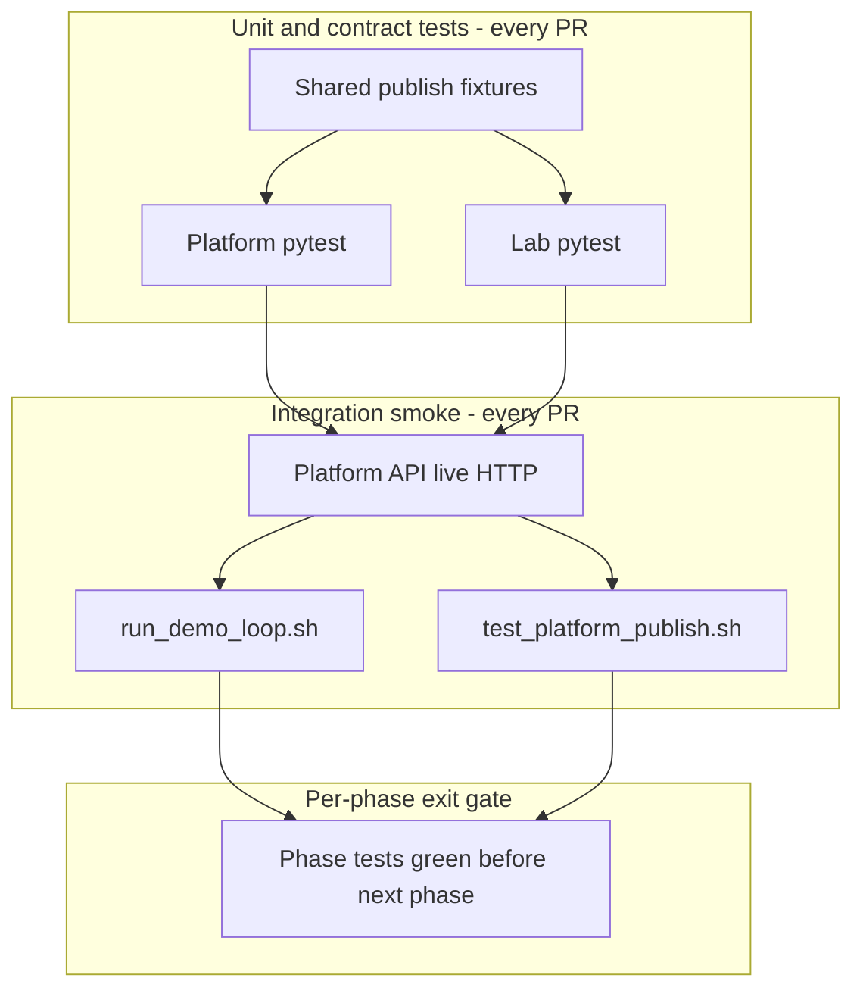

# HLD Test-First Implementation Plan

> **Canonical execution plan** for post-MVP work (Phases 9–13 across **eval-driven-design-platform** and **edd-agent-lab**). Supersedes the removed `EVAL_DRIVEN_DESIGN_PLAN.md`. Product intent and object definitions remain in [`docs/hld/`](hld/README.md).

**Status:** Phases 9–12 and 13a complete · **13b lab workbench implemented (uncommitted)** · **13c + docs pending** · Phases **14–16 deferred** (see [HLD gap analysis](#hld-gap-analysis-post-phase-13)).

## Design document hierarchy (read before UI work)

| Doc | Repo | Surface | Role |
|---|---|---|---|
| [10-ideal-developer-experience.md](https://github.com/bfalkowski/edd-agent-lab/blob/main/docs/10-ideal-developer-experience.md) | lab | Both repos | **Stack north star** — full EDD loop; lab owns local runs + side-by-side compare |
| [11-ideal-console-design.md](https://github.com/bfalkowski/edd-agent-lab/blob/main/docs/11-ideal-console-design.md) + [HLD-011](hld/HLD-011-console-information-architecture.md) | platform | `:8501` | **Platform console ideal** — Design / Build / Evaluate / Operate; do not rebuild in lab |
| [12-lab-console-design.md](https://github.com/bfalkowski/edd-agent-lab/blob/main/docs/12-lab-console-design.md) | lab | `:8502` | **Lab workbench spec (implement now)** — context bar, v0 \| v1, EDD verdict, details tabs |
| [07-final-milestone-side-by-side-console.md](https://github.com/bfalkowski/edd-agent-lab/blob/main/docs/07-final-milestone-side-by-side-console.md) | lab | legacy | Turn-by-turn **chat** console for `customer-solution`; not the escalation workbench |

**Rule:** Platform lifecycle UI follows **11 + HLD-011**. Lab workbench follows **12 only**. Both implement the same HLD-005 story from **10**, split by repo boundary.

# HLD Implementation Plan (Test + CI First)

## Current baseline

| Repo | CI today | Gap |
|---|---|---|
| [.github/workflows/ci.yml](.github/workflows/ci.yml) | API + console pytest, Ruff, mypy, OpenAPI drift, security, Docker, Helm | No lab publish smoke; no shared contract fixtures; [DEMO_SCRIPT.md](docs/DEMO_SCRIPT.md) is manual-only |
| [edd-agent-lab/.github/workflows/ci.yml](edd-agent-lab/.github/workflows/ci.yml) | pytest (3.12/3.13), Ruff, CLI smoke for `customer-solution` | No live platform integration |

**Working integration seam (v1):** `POST /v1/integrations/runs/publish` → `ExperimentRun.ingest` → `GET /v1/experiment-runs/{id}/gate`. Covered by [api/tests/test_lab_integration.py](api/tests/test_lab_integration.py), [api/tests/test_quality_gates.py](api/tests/test_quality_gates.py), and local [edd-agent-lab/scripts/test_platform_publish.sh](edd-agent-lab/scripts/test_platform_publish.sh).

**Restore point:** both repos tagged `v0.1.0` before HLD-driven work.

**Guiding rules:**
- Follow this plan (Phases **9 → 13**, then **15+** as needed) in order; defer Phases **14–16** until 13c exits.
- **Spike / clarity over long-term backward compat:** v1 publish + gate is a temporary safety net; deprecate once v2 reference scenario demo path works end-to-end.
- **Strangler pattern:** v1 ingest + gate path must stay green while v2/HLD objects are added alongside.
- **No AI provider keys in CI (hard constraint):** documented in both repos' `AGENTS.md` and `docs/QUALITY_GATE_CI.md` (platform `8f0454c`, lab `40a1134`).

**Landings (main):** Phases 9–12 complete; **13a complete**; **13b** — platform slice + lab doc-12 workbench landed in working tree; **13c next** (Gates/Promotion + validation script). **Not scheduled yet:** greenfield agent/scenario entry ([Phase 15](#phase-15--greenfield-agent-entry-platform--lab)).

## HLD coverage matrix

The original todos mapped to **Phases 9–13**, not one-to-one with all 12 HLDs. Gap-filling PRs (**10c, 11c, 12c, 13c, docs**) were added after review.

| HLD | Topic | Covered by | Gap / notes |
|---|---|---|---|
| **HLD-001** | Product intent & boundaries | AGENTS.md; existing MVP | Enforced by review — no separate PR |
| **HLD-002** | Domain object model | 10a, 10c, 11a, 12a, 12c, 13c | YAML/Pydantic first; full DB later |
| **HLD-003** | EDD workflow | 13b + **13c** validation script | Cross-cutting workflow |
| **HLD-004** | Tool requirements & feasibility | 11a, **11c** console | Mock/local badges in 11c |
| **HLD-005** | Reference scenario | 10a, 13a, 13b, **13c** | Exit: validation script passes |
| **HLD-006** | MVP plan (meta) | Full PR sequence + **docs** | M6 scripts in 13b/13c |
| **HLD-007** | Platform API & integration | 9a–9d, 11b | Idempotency in 11b scope |
| **HLD-008** | Langfuse integration | Existing Phases 4–6 + **12c** TraceLink | Live Langfuse optional nightly |
| **HLD-009** | Architecture diagrams | **docs** README refresh | Docs-only |
| **HLD-010** | Graph design & rule mapping | **10c** | Table/text diff, not graph renderer |
| **HLD-011** | Console IA | 10b, 11c, 12b, 13b platform, **13c** | Platform `:8501` per HLD-011/ideal-11; lab `:8502` per **doc 12** (not a copy of 11) |
| **HLD-012** | Versioning, gates, promotion | 11a, 12a, **13c** | OperationalRun → Phase 14 defer |

**Previously missing from todos:** HLD-008 TraceLink publish, HLD-010 GraphDesign, HLD-011 Gates/Promotion screens, HLD-012 PromotionRecord, HLD-006 `validate_reference_scenario.sh`, HLD-009 README.

## PR breakdown (execution order)

Each PR should land with tests green and not start the next until the prior phase exit criteria hold.

| PR | Repo | Scope | Done when |
|---|---|---|---|
| **9a** | platform | `contracts/publish/v1/` + `test_publish_contract_fixtures.py` | Fixtures round-trip via TestClient; existing `test_lab_integration.py` unchanged |
| **9b** | lab | `test_publish_envelope_matches_contract.py` | Lab envelope builder matches platform fixtures |
| **9c** | platform | `integration-lab-smoke` CI job | Cross-repo smoke green on platform PRs |
| **9d** | platform | `run_demo_loop.sh` + `verify_demo.sh` + CI `demo-loop-api` | Automates [DEMO_SCRIPT.md](docs/DEMO_SCRIPT.md) steps 2–7 against live API (auth + optional postgres) |
| **10a** | platform | `api/app/domain/edd/` + HLD-005 YAML + schema tests | All example artifacts validate |
| **10b** | platform | Console Target / Rules / Eval Contract (read-only) | Console pytest green; Phase 9 CI still green |
| **10c** | both | GraphDesign + `graph-design.yaml` + console node table (HLD-010) | v0/v1 graph diff explains failure-driven nodes |
| **11a** | platform | Tool/information schemas + multi-dimensional gates | `pass_for_demo_not_production` in gate API tests |
| **11b** | both | Publish v2 + v2 fixtures; idempotency note; v1 compat tests | v1 and v2 both pass contract + integration smoke |
| **11c** | platform | Information / Tool / Tool Feasibility console (HLD-004) | Mock/local tool status visible |
| **12a** | platform | FailurePacket/FixPlan/Comparison/GateResult ingest | v0 failure → gate fail with rule id |
| **12b** | both | Lab publishers + console Failure/Fix/Compare + smoke extension | Structured fail + pass in smoke script |
| **12c** | both | TraceLink in publish + console trace links (HLD-008) | Placeholder trace IDs OK; tool_mode on metadata |
| **13a** | lab | Reference agent v0/v1 + mock data + cli-smoke | v0 fails `separate_facts_from_hypotheses` |
| **13b** | both | See **[PR 13b checklist](#pr-13b-checklist-design-aligned)** below | HLD-005 story end-to-end; lab default view matches doc 12 |
| **13c** | platform | PromotionRecord + version timeline + Gates/Promotion UI + `validate_reference_scenario.sh` | `promoted_for_demo`; production blocked |
| **docs** | platform | README diagrams (HLD-009) + HLD-006 progress | Can land anytime after 13b |
| **14** | platform | OperationalRun, promotion persistence, approval-gated writes (HLD-012) | Deferred — see below |
| **15** | both | Greenfield agent/scenario **entry** — platform create + lab selector (not full generation) | User can start a new target; lab picks agent/scenario |
| **16** | platform (+ lab) | **Derived artifact generation** — rules/eval/requirements/graph/fix from target/failure (HLD-003) | Matches HLD-003 workflow AC 1–5, 8 |

**Optional follow-up (not blocking):** auth-on `integration-lab-smoke` job after 9c stabilizes; nightly `verify_demo.sh --postgres --langfuse` for Langfuse path.

### PR 13b checklist (design-aligned)

**Platform (`:8501`) — per [HLD-011](hld/HLD-011-console-information-architecture.md) / ideal-11**

- [x] Overview lifecycle context + reference scenario story
- [x] Design / feasibility / evidence pages (read-only reference YAML)
- [x] Failure / Fix / Compare pages wired to reference artifacts

**Lab (`:8502`) — per [12-lab-console-design.md](https://github.com/bfalkowski/edd-agent-lab/blob/main/docs/12-lab-console-design.md)**

- [ ] **Context bar** — agent, scenario, v0/v1, tool mode, platform status; primary actions (Run v0, Run v1, Compare, Publish)
- [ ] **Scenario summary** — compact problem + expected behavior (not full mock JSON on default view)
- [ ] **Side-by-side panels** — score, gate badge, graph summary, tool mode, response, failure/improvement callout
- [ ] **EDD verdict panel** — v0 failure, v1 fix, resolved failure, production blocked, promotion hint
- [ ] **Details tabs** — Graph Diff | Tools | Scores | Traces | Artifacts | Publish (secondary; collapsed by default)
- [ ] **Remove anti-patterns** — no platform lifecycle strip on default view; no “load scenario” gate before run; no observability wall
- [ ] **Doc 12 acceptance criteria** — all 12 items in [12-lab-console-design.md § Acceptance Criteria](https://github.com/bfalkowski/edd-agent-lab/blob/main/docs/12-lab-console-design.md#acceptance-criteria)

**Both repos**

- [x] Reference publish enrichment (v0 failure + v1 comparison/gate/trace bundle)
- [x] `scripts/demo_customer_escalation_triage.sh` + `edd-lab demo-escalation`
- [ ] `make ci` green both repos; manual smoke: platform `:8501` story + lab `:8502` matches doc 12 default layout

---

## Automating DEMO_SCRIPT.md

[docs/DEMO_SCRIPT.md](docs/DEMO_SCRIPT.md) is a **manual Streamlit walkthrough**, but operators use it because it exercises the **real integration stack** — things unit tests often skip:

| Demo step | Manual today | Already automated | Gap |
|---|---|---|---|
| 1 Overview / health | Click console | `local_e2e.sh` smoke (health/ready/metrics only) | Console UI not checked |
| 2 Create EvalSpec | Console form | `test_eval_crud.py` (TestClient, memory, auth off) | Live API + auth + postgres |
| 3 Create EvalCase | Console form | Same pytest | Same |
| 4 Run experiment | Console | `test_experiment_runs.py` | Same |
| 5 Results Explorer | Console | Partial API GET tests | Same |
| 6 Quality gate | Console + `run_quality_gate.sh` | `test_quality_gates.py` + auth-aware `run_quality_gate.sh` (9d) | Live API + auth covered by `demo-loop-api` |
| 7 Lab publish | `test_platform_publish.sh` | Lab script + `integration-lab-smoke` CI (9c) | Optional chain in `run_demo_loop.sh` when `LAB_ROOT` set |
| 8 Decide | Human | N/A | N/A |

**Conclusion:** Yes — we can automate most of the demo **API path** without browser tests. Keep DEMO_SCRIPT.md for human UI validation; add scripts + CI for regression protection.

### Tier 1 — API demo loop (PR 9d, CI on every PR)

New **`scripts/run_demo_loop.sh`** against an **already-running** API:

```text
1. GET /v1/health, /v1/ready
2. POST /v1/eval-specs (bearer or tenant_id)
3. POST /v1/eval-cases
4. POST /v1/experiment-runs (candidate prompt_v4)
5. GET /v1/experiment-runs/{id}/summary + /v1/evaluation-results
6. GET /v1/experiment-runs/{id}/gate + assert exit via gate logic
7. (optional) invoke ../edd-agent-lab/scripts/test_platform_publish.sh if LAB_ROOT set
```

Also:

- **`scripts/verify_demo.sh`** — one command for local pre-push: start stack → demo loop → optional lab smoke → stop
- **Fix [run_quality_gate.sh](scripts/run_quality_gate.sh)** — honor `EDD_API_KEY` / `Authorization` (matches demo prerequisites)
- **Extend [local_e2e.sh](scripts/local_e2e.sh)** — optional `--demo-loop` flag after smoke
- **Update DEMO_SCRIPT.md** — add “Automated equivalent” section

**CI job `demo-loop-api`:** start API (memory, **auth on**, mint JWT) → run `run_demo_loop.sh`. Catches auth wiring and live HTTP regressions pytest misses.

### Tier 2 — Full stack verify (local + optional nightly CI)

`verify_demo.sh --postgres` with `--no-console` mirrors demo prerequisites (migrations, persistence). Optional nightly workflow with Postgres service container.

### Tier 3 — Console UI (defer)

No Playwright for Streamlit in MVP. Console UX stays manual in DEMO_SCRIPT sections 1–5; helpers covered by console pytest.



---

## Testing strategy (applies to every phase)

### Test pyramid

1. **Unit (fast, both repos, every PR)** — Pydantic/schema validation, gate logic, envelope builders, console helpers. Keep deterministic mocks ([AGENTS.md](AGENTS.md): mock evaluator by default).
2. **Contract (fast, both repos)** — Golden JSON fixtures for publish envelope v1 (today) and v2 (target). Both sides assert the same shapes; platform additionally round-trips via `TestClient`.
3. **Integration smoke (slower, cross-repo, every PR)** — Start platform API, run [test_platform_publish.sh](edd-agent-lab/scripts/test_platform_publish.sh) (lab ingest path).
4. **Demo loop (medium, every PR after PR 9d)** — [run_demo_loop.sh](scripts/run_demo_loop.sh) mirrors [DEMO_SCRIPT.md](docs/DEMO_SCRIPT.md) steps 2–6 via live HTTP with auth.
5. **Full verify (nightly / pre-release)** — `verify_demo.sh --postgres` (+ optional lab publish); optional Langfuse overlay.
6. **Phase demo script (after Phase 13)** — Full HLD-005 reference scenario narrative.

### CI invariants to protect

- Platform: `make test` (api + console pytest) stays required.
- Lab: existing `cli-smoke` job for `customer-solution` must not regress when adding `customer-escalation-triage`.
- Cross-repo lab smoke uses **Python 3.12** and memory + auth off for speed (job 9c).
- **Demo loop** job (9d) uses **auth on** — closer to manual demo and [run_quality_gate.sh](scripts/run_quality_gate.sh) fix.
- **No AI provider keys in CI (hard constraint).** All pytest, smoke, demo-loop, and validation scripts must pass without `OPENAI_API_KEY` / other model-provider credentials. Live LLM is opt-in only and must auto-skip or fall back to mock when creds are absent. (`EDD_API_KEY` in CI is platform JWT auth, not a provider key.)
- Langfuse remains optional/off in CI (no external dependency).

### Fixture ownership

Put canonical contract fixtures in the **platform** repo (control plane owns the contract per [HLD-007](docs/hld/HLD-007-platform-api-and-integration.md)):

```text
contracts/publish/
  v1/envelope-pass.json
  v1/envelope-fail-failure-packet.json
  v1/response-minimal.json
  v2/envelope-v1-evidence-triage-graph.json   # added in Phase 11–12
  README.md                                   # field semantics, not prose docs
```

Lab tests load copies under `tests/fixtures/publish/` **or** read from checked-out platform path in the cross-repo CI job only. Add a small `scripts/check_publish_fixtures_sync.sh` if both copies are kept to prevent drift.

---

## Phase 9 — Integration contract + CI harness (start here)

**Maps to:** Phase 9 below, [HLD-006](hld/HLD-006-mvp-implementation-plan.md) M4 partial completion.

### Deliverables

| Item | Repo | Details |
|---|---|---|
| Contract fixtures | platform | v1 pass/fail envelopes + minimal response JSON from existing tests |
| `test_publish_contract_fixtures.py` | platform | Parametrize over fixtures → `POST /v1/integrations/runs/publish` via [conftest memory client](api/tests/conftest.py); assert status, `gate_status`, ingest fields |
| `test_publish_envelope_matches_contract.py` | lab | `build_publish_envelope()` output matches fixture keys for committed run-record snapshots |
| Cross-repo CI job `integration-lab-smoke` | platform | After `api-tests`: checkout lab, start API, run smoke script |
| Demo loop automation | platform | `run_demo_loop.sh`, `verify_demo.sh`, fix `run_quality_gate.sh` auth, CI `demo-loop-api` job |
| CI doc | platform | Short section in [docs/QUALITY_GATE_CI.md](docs/QUALITY_GATE_CI.md) describing new jobs |

### Suggested platform CI job sketch

```yaml
integration-lab-smoke:
  needs: [api-tests]
  runs-on: ubuntu-latest
  steps:
    - uses: actions/checkout@v5
    - uses: actions/checkout@v5
      with:
        repository: bfalkowski/edd-agent-lab
        path: edd-agent-lab
    - uses: astral-sh/setup-uv@v6
      with: { python-version: "3.12" }
    - name: Start API
      working-directory: api
      run: |
        uv sync --extra dev
        uv run uvicorn app.main:app --host 127.0.0.1 --port 8000 &
        for i in $(seq 1 30); do curl -sf http://127.0.0.1:8000/v1/health && break; sleep 1; done
      env:
        APP_STORAGE_BACKEND: memory
        APP_AUTH_ENABLED: "false"
    - name: Lab publish smoke
      working-directory: edd-agent-lab
      env:
        EDD_PLATFORM_ROOT: ${{ github.workspace }}
      run: ./scripts/test_platform_publish.sh
```

### Exit criteria (Phase 9)

- [x] Contract fixtures committed and validated in platform pytest
- [x] Lab envelope tests reference fixtures (or sync check passes)
- [x] `integration-lab-smoke` green on platform PRs
- [x] Existing v1 tests in [test_lab_integration.py](api/tests/test_lab_integration.py) unchanged behavior (regression guard)

---

## Phase 10 — Design intent on platform (HLD-006 M2)

**Maps to:** HLD-002 objects, HLD-005 example artifacts.

### Deliverables

| Item | Repo | Details |
|---|---|---|
| Pydantic models | platform | New package e.g. `api/app/domain/edd/` for `Agent`, `AgentTarget`, `BehaviorRule`, `EvalContract` (minimum first pass per [HLD-006 M2](docs/hld/HLD-006-mvp-implementation-plan.md)) |
| Example YAML | platform | `examples/customer_escalation_triage/*.yaml` matching [HLD-005](docs/hld/HLD-005-reference-scenario-customer-escalation-triage.md) |
| Validation tests | platform | `tests/test_edd_artifact_schemas.py` — every YAML loads and validates |
| Read API (optional persistence) | platform | Start with file-backed or ingest-linked IDs; **avoid big-bang DB migration** until schemas stabilize |
| Console read views | platform | Target / Rules / Eval Contract pages (read-only OK for exit) — **10b** |
| Graph design | both | `GraphDesign` schema, v0/v1 YAML, console node table — **10c** |

### Exit criteria

- [x] All HLD-005 design artifacts validate against schemas (incl. graph-design v0/v1)
- [x] `make test` green; Phase 9 integration job still green
- [x] No regression to v1 publish path

---

## Phase 11 — Tool feasibility + readiness gates (HLD-006 M2 + M4)

**Maps to:** HLD-004, HLD-012 readiness dimensions.

### Deliverables

| Item | Repo | Details |
|---|---|---|
| Schemas | platform | `InformationRequirement`, `ToolRequirement`, `ToolFeasibilityReview`, `ReadinessStatus` |
| Gate service extension | platform | Extend [quality gate service](api/tests/test_quality_gates.py) beyond score threshold: behavior vs tool vs production |
| Publish v2 (additive) | both | `schema_version: "2"` with optional `tool_bindings`, `tool_mode_summary`; **v1 still accepted** |
| Contract fixtures v2 | platform | Add v2 envelope + expected response fields (`behavior_status`, `tool_status`, `production_status`) per [HLD-007](docs/hld/HLD-007-platform-api-and-integration.md) |
| Console | platform | Information Requirements, Tool Requirements, Tool Feasibility pages |

### Tests to add

- Platform: parametrize gate tests for `pass_for_demo_not_production` when tools are mock/local
- Lab: publish builder emits v2 fields when tool bindings present
- Contract: v1 fixtures still pass (backward compatibility test)

### Exit criteria

- [x] `pass_for_demo_not_production` representable in gate API response
- [x] v1 and v2 envelopes both accepted in contract + integration smoke

---

## Phase 12 — Evidence loop: failure → fix → compare (HLD-006 M4)

**Maps to:** HLD-003 workflow phases, HLD-012 comparison/gates.

### Deliverables

| Item | Repo | Details |
|---|---|---|
| Schemas + normalization | platform | `FailurePacket`, `FixPlan`, `Comparison`, `GateResult`, `PromotionRecord` — normalize from ingest JSON initially |
| Lab artifact publishers | lab | Structured `failure_packets`, `fix_plan`, `comparison` in publish envelope (v2) |
| API | platform | GET endpoints or embedded in run detail; comparison links v0 ↔ v1 |
| Console | platform | Failure Packets, Fix Plans, Compare Versions pages |

### Tests to add

- Platform: ingest run with v0 failure packet referencing `separate_facts_from_hypotheses` → gate fail with explanation
- Platform: v1 comparison artifact stored and retrievable
- Lab: unit tests for failure packet builder from eval output
- Extend smoke script: assert failure-packet gate path for reference scenario (once lab agent exists)

### Exit criteria

- [x] HLD-005 v0→v1 story expressible in platform data (API or ingest), not only in lab files
- [x] Integration smoke covers at least one fail + one pass publish with structured failure metadata

---

## Phase 13 — Console lifecycle + lab reference agent (HLD-006 M3 + M5 + M6)

**Maps to:** HLD-011 (platform), [12-lab-console-design](https://github.com/bfalkowski/edd-agent-lab/blob/main/docs/12-lab-console-design.md) (lab), HLD-005 reference agent, HLD-010 graph design.

### Deliverables

| Item | Repo | Design doc | Details |
|---|---|---|---|
| Reference agent | lab | HLD-005 | `customer-escalation-triage` v0/v1; keep `customer-solution` |
| Mock tools + data | lab | HLD-005 | `data/mock/customer_escalation_triage/apex_health/*` |
| Lab CI | lab | — | `cli-smoke` includes reference agent v0/v1 |
| Platform console | platform | HLD-011, ideal-11 | Overview lifecycle + reference design/evidence pages (`:8501`) |
| Lab workbench UI | lab | **doc 12** | Context bar → scenario summary → v0 \| v1 → EDD verdict → details tabs (`:8502`) |
| Demo script | lab | HLD-006 M6 | `scripts/demo_customer_escalation_triage.sh`, `edd-lab demo-escalation` |

### Exit criteria

- [x] Lab v0 fails expected rule; v1 reaches `pass_for_demo_not_production`
- [x] Lab publishes both runs; platform console navigates full story (`:8501`)
- [ ] Lab `:8502` default view satisfies [doc 12 acceptance criteria](https://github.com/bfalkowski/edd-agent-lab/blob/main/docs/12-lab-console-design.md#acceptance-criteria)
- [ ] All CI jobs green: platform unit + integration, lab unit + cli-smoke

---

## Phase 14 — Defer (Operate)

**Maps to:** HLD-003 workflow AC 12, HLD-011 Operate mode, HLD-012 operational promotion.

OperationalRun, PromotionRecord **persistence**, approval-gated write tools, Live Run / Action Queue console only after Phases 10–13 are stable. **13c** may show PromotionRecord read-only from YAML before persistence lands.

---

## Phase 15 — Greenfield agent entry (platform + lab)

**Maps to:** [HLD-003](docs/hld/HLD-003-evaluation-driven-design-workflow.md) AC 1 (start from `AgentTarget`), [HLD-006](docs/hld/HLD-006-mvp-implementation-plan.md) MVP story step 1, [doc 10 §35](https://github.com/bfalkowski/edd-agent-lab/blob/main/docs/10-ideal-developer-experience.md) Target-to-v0 entry, [HLD-011](docs/hld/HLD-011-console-information-architecture.md) empty states (“No target — start by describing what this agent should do”).

**Why this phase exists:** Phases 9–13 prove the **reference** vertical slice (HLD-005). They do **not** give users a starting point for a **new** agent or scenario. Without Phase 15, the stack only replays Customer Escalation Triage via CLI/files.

**Non-goals (stay out of 15):** Full LLM generation of rules/graph (→ Phase 16); operational runs (→ Phase 14); lab-side target authoring (platform owns design intent per doc 12).

### Platform (`:8501`) — Design **create** entry

| Deliverable | Details |
|---|---|
| **AgentTarget intake** | Minimal form or wizard: name, purpose, users, goals, non-goals, risk areas, output style |
| **Persist target** | File-backed YAML under `examples/` or platform store; optional `POST /v1/targets` per [HLD-007](docs/hld/HLD-007-platform-api-and-integration.md) |
| **Empty-state wiring** | HLD-011 empty states link to create flow when no target selected |
| **Scenario stub** | Optional: create/link EvalCase or scenario id for lab (can remain YAML in lab repo initially) |
| **Read path** | Existing Design pages load **selected** target (not only HLD-005 reference bundle) |

**Exit:** A user can create a new `AgentTarget` in the platform console without editing YAML by hand; Design pages show that target (rules/eval may still be empty until Phase 16).

### Lab (`:8502`) — Workbench **selector** (not author)

| Deliverable | Details |
|---|---|
| **Agent/scenario picker** | Choose from lab registry (`agents/registry`, `scenarios/`) + platform-linked target id |
| **Version pair selection** | Default v0/v1 labels per agent; reference scenario remains one preset |
| **Reuse doc 12 layout** | Context bar, compare, verdict, details tabs unchanged — only **context** is parameterized |
| **CLI parity** | `edd-lab list-scenarios`, agent keys documented |

**Exit:** Lab workbench is not hardcoded to Customer Escalation Triage only; user selects agent + scenario before Run/Compare. Authoring new targets still happens on `:8501`.

### Tests / CI

- Platform: schema + create-target API or file write test; console smoke creates target and loads Design page
- Lab: registry lists ≥2 agents (reference + existing `customer-solution`); selector switches scenario id in session
- Cross-repo: optional — new target id referenced in lab publish metadata (stub rules OK)

### PR split (suggested)

| PR | Repo | Scope |
|---|---|---|
| **15a** | platform | AgentTarget create + persist + empty states |
| **15b** | lab | Registry + `:8502` agent/scenario/version selector |
| **15c** | both | Link platform target id ↔ lab agent key; docs update |

---

## Phase 16 — Derived artifact generation (defer)

**Maps to:** HLD-003 AC 2–5, 8; doc 10 Milestones 1–2 (generate rules, eval contract, requirements, fix plan, graph scaffold).

Not scheduled until Phase 15 entry exists. Includes:

- Generate `BehaviorRule`s and `EvalContract` from `AgentTarget` (guided or templated — not necessarily LLM in MVP)
- Generate `InformationRequirement`s → `ToolRequirement`s → feasibility review stubs
- Generate initial `GraphDesign` / v0 scaffold for lab
- Generate `FixPlan` from `FailurePacket` (bounded fix suggestions)
- Lab runs v0 on generated contract; failures map to rules

**Anti-pattern to avoid:** Jumping to Phase 16 before Phase 15 — generation without a create/selector entry repeats the “reference-only demo” problem.

---

## HLD gap analysis (post Phase 13)

What Phases **9–13c** cover vs what the **HLD pack + doc 10** still require:

| Source | Requirement | Plan status after 13c | Gap phase |
|---|---|---|---|
| **HLD-003** AC 1 | Start from `AgentTarget`, not only code | Reference YAML only | **15** |
| **HLD-003** AC 2–3 | Generate rules, eval contract, requirements from target | Manual HLD-005 artifacts | **16** |
| **HLD-003** AC 4–11 | Feasibility, graph, v0/v1, failure, compare, gates, promotion | **13a–13c** (reference path) | Largely covered for HLD-005 |
| **HLD-003** AC 12 | `OperationalRun` with traceability | Not planned | **14** |
| **HLD-006** M1–M6 | Full MVP loop + validation script | M6 partial until `validate_reference_scenario.sh` | **13c** |
| **HLD-007** | `POST /v1/targets`, GET agents/versions/comparisons as resources | Publish + gate only; rest in ingest JSON | **15** (create), later (read API) |
| **HLD-008** | Langfuse trace evidence, TraceLink | 12c placeholders; no live Langfuse in CI | Optional nightly; not blocking MVP |
| **HLD-009** | Architecture diagrams in README | Pending **docs** PR | **docs** |
| **HLD-010** | Graph design explains failure-driven nodes | 10c read-only table | **16** for generation |
| **HLD-011** Design **create** + Build/Operate screens | Read-only reference pages; EvalSpec legacy nav | Create + Prompts/Tool Bindings editor + Operate | **15**, **16**, **14** |
| **HLD-011** empty states | Guided “start here” copy | Static reference load only | **15** |
| **HLD-012** | PromotionRecord persistence, version timeline | 13c read-only YAML OK | **14** persistence |
| **Doc 10** §35–37 | Target-to-v0, v0-to-v1 fix, operational flow | §37 operational missing; §35–36 partial (reference only) | **15**, **16**, **14** |
| **Doc 12** | Lab workbench compare/publish | **13b** reference workbench | **15b** multi-agent selector |
| **EvalSpec → EvalContract** | Console/API mental model migration | Both coexist; EvalSpec pages still primary spine | Gradual; document in **docs** |

**Bottom line:** Finishing **13c** completes the **HLD-005 reference demo**. It does **not** complete **HLD-003** or **HLD-006** as full products. **Phase 15** is the minimum next product increment so the stack matches “a user defines a new agent target” — the opening line of the HLD-006 MVP story.

---

## Phase 13c preview (design-aligned)

**Platform only** — per [HLD-011](hld/HLD-011-console-information-architecture.md) / ideal-11 § Gates / Promote (not lab doc 12):

- [ ] PromotionRecord + version timeline (read-only YAML OK for exit)
- [ ] Gates / Promotion console pages
- [ ] `scripts/validate_reference_scenario.sh` — automated HLD-005 acceptance
- [ ] Update HLD-006 progress table + README diagrams (HLD-009) in **docs** PR

---

## Per-PR workflow (recommended)

```text
0. UI work: read design doc for surface — platform :8501 → HLD-011/ideal-11; lab :8502 → doc 12
1. Read relevant HLD section + plan phase exit criteria
2. Add/update contract fixture or test first (red)
3. Minimal implementation (green)
4. Run locally:
   - platform: make test
   - lab: pytest -q
   - cross-repo: ./scripts/local_e2e.sh && edd-agent-lab/scripts/test_platform_publish.sh
5. Open PR — CI must pass all required jobs before merge
6. Update HLD-006 progress table when phase exits
```

---

## Risk mitigations

| Risk | Mitigation |
|---|---|
| Cross-repo CI flakiness | Memory backend, health poll, pin lab to `main` or explicit SHA input |
| Fixture drift between repos | Single canonical path in platform; sync check script |
| v2 breaks v1 publish | Explicit backward-compat contract tests; never remove v1 fields without deprecation period |
| Scope creep into Phase 14 | Console/API read-only promotion records until demo path is stable |
| Langfuse in CI | Keep `LANGFUSE_ENABLED=false` in all automated tests |
| Live LLM in CI | Hard no — opt-in locally/nightly only; auto-skip or mock fallback when provider keys absent |

---

## Suggested first PR (Phase 9 only)

Smallest valuable slice — can land as **9a → 9d** in order:

1. **9a** — `contracts/publish/v1/*.json` + `test_publish_contract_fixtures.py`
2. **9d** — `run_demo_loop.sh` + fix `run_quality_gate.sh` auth (immediate value; replaces manual demo for API checks)
3. **9c** — `integration-lab-smoke` CI job
4. **9b** — lab contract tests

Note: **9d before 9c** is fine if you want local demo automation before cross-repo CI wiring.

This unlocks safe delivery of M2–M6 with continuous regression protection.
