# HLD-009: Architecture and Flow Diagrams

## Status

Draft

## Purpose

This document provides readable architecture diagrams for the **EDD stack**.

The goal is not to put the entire system into one large diagram. The EDD stack has several related flows, and each flow is easier to understand when shown separately.

This document includes:

```text
1. System context diagram
2. User lifecycle flow
3. Target-to-graph design flow
4. Lab-to-platform publish API flow
5. Langfuse trace evidence flow
6. Tool feasibility and readiness flow
7. v0-to-v1 improvement flow
8. Promotion and operational use flow
9. Customer Escalation Triage reference story
10. Platform console information flow
11. File / artifact flow
12. Diagram usage guidance
```

The diagrams use Mermaid where helpful, but each diagram is intentionally scoped.

See also:

- [HLD-001: Product intent and system boundaries](HLD-001-product-intent-and-system-boundaries.md)
- [HLD-003: Evaluation-driven design workflow](HLD-003-evaluation-driven-design-workflow.md)
- [HLD-005: Reference scenario](HLD-005-reference-scenario-customer-escalation-triage.md)
- [HLD-007: Platform API and integration](HLD-007-platform-api-and-integration.md)
- [HLD-008: Langfuse integration](HLD-008-langfuse-integration.md)

---

## 1. System Context

This diagram shows the three major systems and their responsibilities.

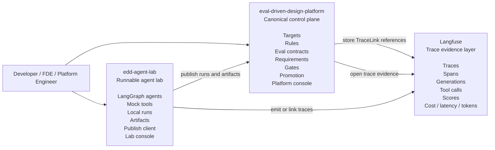

### Key point

```text
Platform = meaning and workflow
Lab = runnable agent implementation
Langfuse = runtime evidence
```

The platform owns canonical workflow state. The lab owns concrete LangGraph implementation and local iteration. Langfuse owns trace evidence.

---

## 2. User Lifecycle Flow

This is the high-level user journey from a new agent idea to a promoted version.

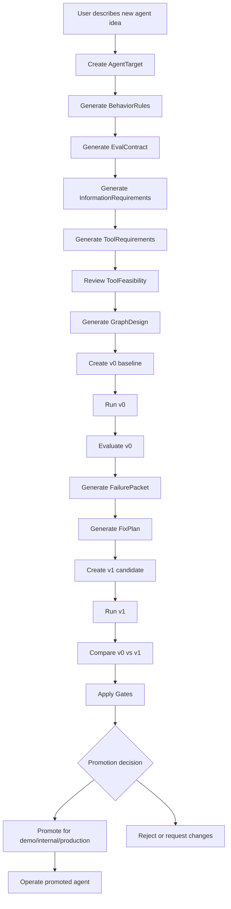

### Key point

The user should not start by comparing v0 and v1. The ideal flow starts earlier with target behavior and design intent.

---

## 3. Target-to-Graph Design Flow

This diagram shows how design intent becomes graph structure.

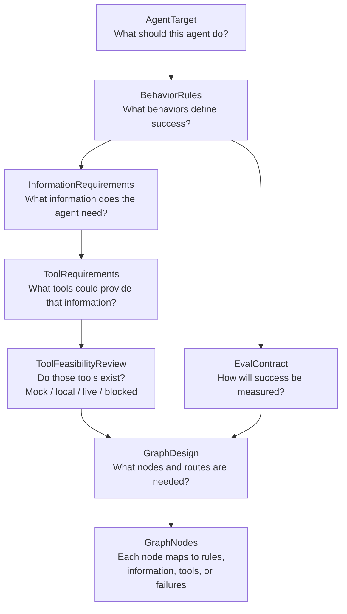

### Example mapping

```text
Rule:
  separate_facts_from_hypotheses

Information required:
  trace evidence
  eval history
  recent changes
  tool health

Tool requirements:
  fetch_trace_summary
  fetch_eval_results
  fetch_recent_changes
  fetch_tool_health

Graph impact:
  collect_evidence
  normalize_evidence
  separate_facts_hypotheses_unknowns
```

### Key point

Graph nodes should not be arbitrary. They should be justified by rules, information needs, tool requirements, failure packets, or operational safety constraints.

---

## 4. Lab-to-Platform Publish API Flow

This sequence shows the concrete integration path between **edd-agent-lab** and **eval-driven-design-platform**.

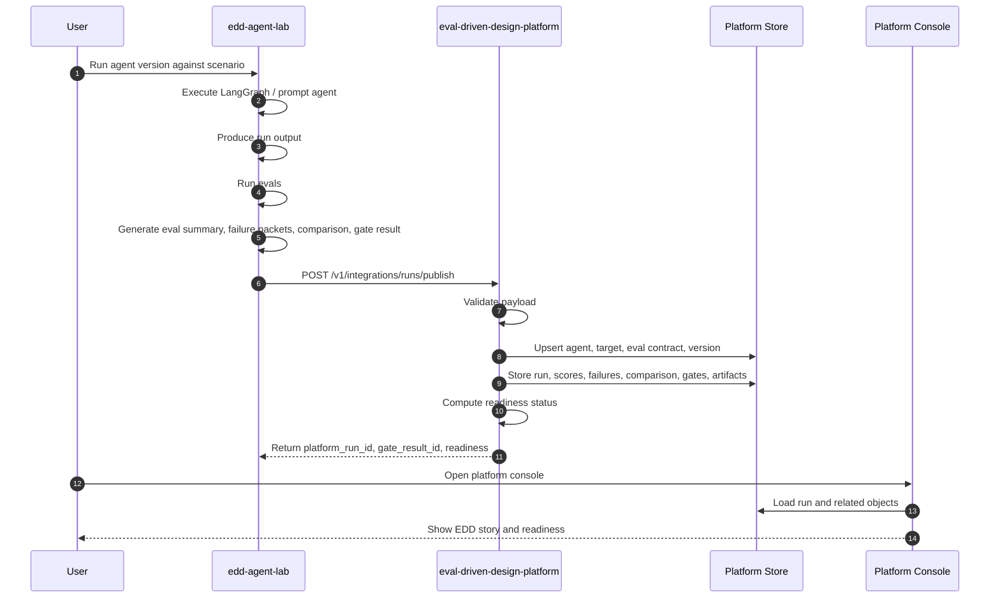

### Primary endpoint

```http
POST /v1/integrations/runs/publish
```

### Deprecated alias

```http
POST /v1/integrations/lab/publish
```

The deprecated alias may exist temporarily, but new code and docs should use `/v1/integrations/runs/publish`.

Publish target is the **platform API** (`:8000`), not the Streamlit console (`:8501`).

### Key point

Running both repos locally is not integration. Integration means lab data is published into the platform and becomes part of the canonical EDD workflow.

See [HLD-007](HLD-007-platform-api-and-integration.md).

---

## 5. Publish Payload Conceptual Structure

This is not a full schema. It shows the conceptual sections of a publish request.

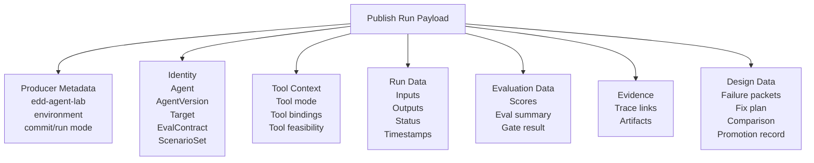

### Key point

The publish payload should not be just `{ version, score }`. It must preserve enough context to explain why a version failed or improved.

---

## 6. Langfuse Trace Evidence Flow

This diagram shows how trace evidence is connected to platform objects.

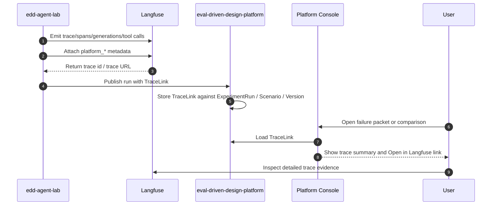

### Required trace metadata

```json
{
  "platform_run_id": "run_v1_001",
  "platform_agent_id": "customer-escalation-triage-agent",
  "platform_agent_version": "v1-evidence-triage-graph",
  "platform_target_id": "customer-escalation-triage-target-v1",
  "platform_eval_contract_id": "customer-escalation-triage-eval-contract-v1",
  "scenario_id": "escalation-latency-quality-regression-001",
  "tool_mode": "mock_local",
  "environment": "local_demo"
}
```

### Key point

Langfuse stores trace evidence. The platform stores the meaning of that evidence.

See [HLD-008](HLD-008-langfuse-integration.md).

---

## 7. Tool Feasibility and Readiness Flow

This diagram shows how the system avoids pretending tools exist.

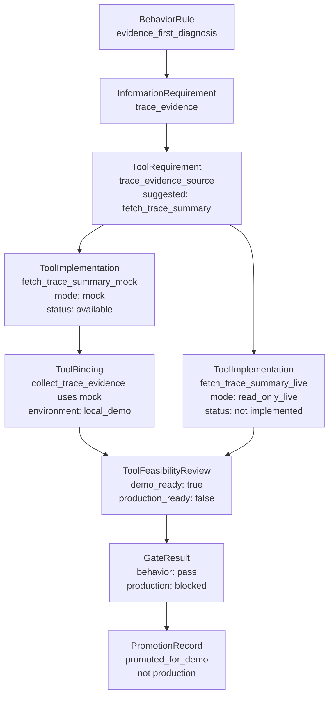

### Key point

A suggested tool is not an implemented tool. A mock implementation can support demo readiness, but it should block production readiness.

See [HLD-004](HLD-004-tool-requirements-and-feasibility.md).

---

## 8. v0-to-v1 Improvement Flow

This diagram shows the core EDD improvement loop.

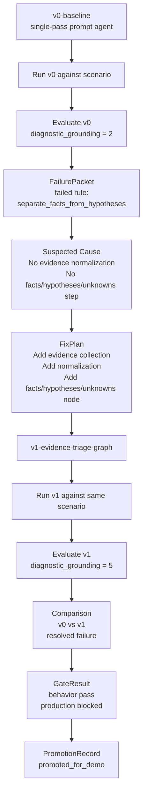

### Key point

v1 should not be an arbitrary rewrite. v1 should be traceable to v0 failures through failure packets and fix plans.

---

## 9. Customer Escalation Triage Reference Story

This diagram summarizes the reference scenario from [HLD-005](HLD-005-reference-scenario-customer-escalation-triage.md).

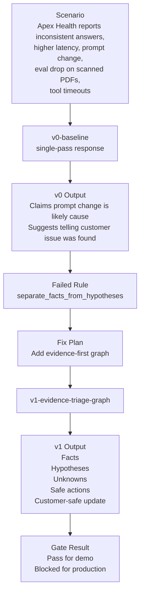

### Key point

The reference story should be understandable in one minute:

```text
v0 guessed.
v1 checked evidence.

v0 overclaimed root cause.
v1 separated facts, hypotheses, and unknowns.

v1 passed behavior gates.
v1 remained blocked for production because required tools were mock/local only.
```

---

## 10. Promotion and Operational Use Flow

This diagram shows how a version moves from evaluated candidate to operational use.

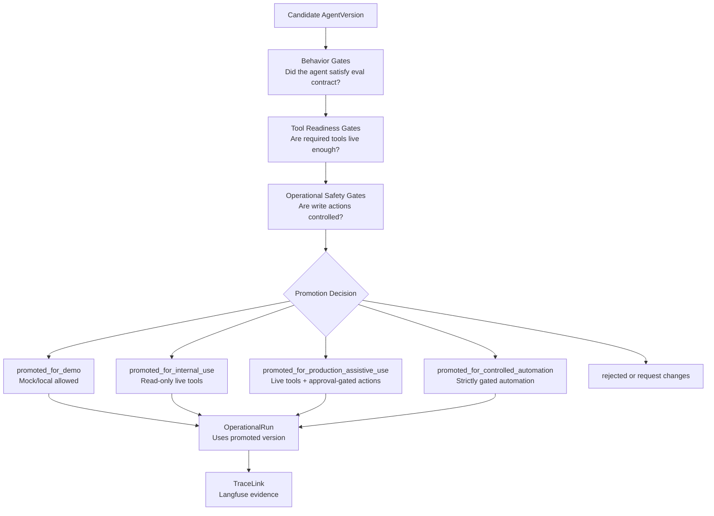

### Key point

Promotion is not binary. A version may be promoted for demo while blocked for production.

---

## 11. Platform Console Information Flow

This diagram shows how the platform console assembles its view.

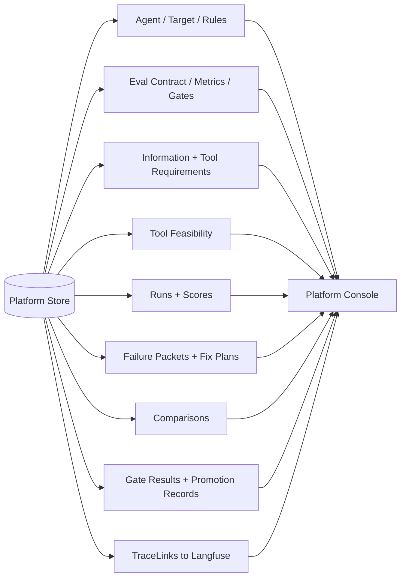

### Required console story

The console must be able to tell this story:

```text
What was the agent supposed to do?
Which rule failed?
What trace proves the failure?
What fix was proposed?
What changed in v1?
Did v1 improve?
What gates passed?
Why is production blocked?
What promotion decision was made?
```

---

## 12. Suggested File / Artifact Flow

This shows how file-based lab artifacts map to platform objects.

```mermaid
flowchart TD
    Files[edd-agent-lab artifacts]

    TargetFile[agent-target.yaml]
    RulesFile[behavior-rules.yaml]
    EvalFile[eval-contract.yaml]
    InfoFile[information-requirements.yaml]
    ToolFile[tool-requirements.yaml]
    FeasFile[tool-feasibility.yaml]
    GraphFile[graph-design.yaml]
    EvalSummary[eval-summary.json]
    FailureFile[failure-packets/*.yaml]
    FixFile[fix-plan.yaml]
    CompareFile[comparison.json]
    GateFile[gate-result.yaml]
    PromotionFile[promotion-record.yaml]

    PlatformObjects[Platform Objects]

    Files --> TargetFile --> PlatformObjects
    Files --> RulesFile --> PlatformObjects
    Files --> EvalFile --> PlatformObjects
    Files --> InfoFile --> PlatformObjects
    Files --> ToolFile --> PlatformObjects
    Files --> FeasFile --> PlatformObjects
    Files --> GraphFile --> PlatformObjects
    Files --> EvalSummary --> PlatformObjects
    Files --> FailureFile --> PlatformObjects
    Files --> FixFile --> PlatformObjects
    Files --> CompareFile --> PlatformObjects
    Files --> GateFile --> PlatformObjects
    Files --> PromotionFile --> PlatformObjects
```

### Key point

File artifacts are useful for the lab and for coding agents. The platform should eventually own canonical objects, but MVP can import/publish structured artifacts.

See [HLD-006](HLD-006-mvp-implementation-plan.md) milestones M2–M3.

---

## 13. Diagram Usage Guidance

Do not try to combine these diagrams into one master diagram.

Use the smallest diagram that answers the current question.

Recommended usage:

| Question | Diagram |
|---|---|
| Explaining the system | System Context (§1) |
| Explaining user experience | User Lifecycle Flow (§2) |
| Explaining why the graph exists | Target-to-Graph Design Flow (§3) |
| Explaining repo integration | Lab-to-Platform Publish API Flow (§4) |
| Explaining Langfuse | Langfuse Trace Evidence Flow (§6) |
| Explaining tool honesty | Tool Feasibility and Readiness Flow (§7) |
| Explaining v0/v1 improvement | v0-to-v1 Improvement Flow (§8) |
| Explaining promotion | Promotion and Operational Use Flow (§10) |
| Explaining the reference demo | Customer Escalation Triage Reference Story (§9) |
| Explaining console UX | Platform Console Information Flow (§11) |
| Explaining lab artifacts | File / Artifact Flow (§12) |

---

## Acceptance Criteria for This HLD

Implementation and documentation are aligned with this HLD when:

1. Architecture docs use multiple focused diagrams instead of one giant diagram.
2. Diagrams preserve the platform/lab/Langfuse boundaries.
3. User flow starts with `AgentTarget`, not `AgentVersion`.
4. API flow shows `POST /v1/integrations/runs/publish`.
5. Langfuse flow treats Langfuse as evidence, not workflow source of truth.
6. Tool flow distinguishes requirement, implementation, binding, and feasibility.
7. Improvement flow ties v1 to v0 failure packets and fix plans.
8. Promotion flow distinguishes demo/internal/production/automation readiness.
9. Console flow shows how the platform assembles the full EDD story.

---

## Summary

The EDD stack is easier to understand as several connected flows.

The most important architectural distinctions are:

```text
Platform owns meaning.
Lab owns runnable implementations.
Langfuse owns trace evidence.

Targets create rules.
Rules create evals and information needs.
Information needs create tool requirements.
Tool feasibility shapes graph design and readiness.
Runs create evidence.
Failures create bounded fixes.
Comparisons create promotion decisions.
```

The diagrams in this document should help coding agents and reviewers keep those boundaries intact.

---

## Related Documents

| Document | Repo | Description |
|---|---|---|
| [HLD index](README.md) | eval-driven-design-platform | HLD series |
| [HLD-003](HLD-003-evaluation-driven-design-workflow.md) | eval-driven-design-platform | Workflow phases |
| [HLD-005](HLD-005-reference-scenario-customer-escalation-triage.md) | eval-driven-design-platform | Reference story diagrams |
| [HLD-006](HLD-006-mvp-implementation-plan.md) | eval-driven-design-platform | MVP milestones |
| [HLD-007](HLD-007-platform-api-and-integration.md) | eval-driven-design-platform | Publish API flow |
| [HLD-008](HLD-008-langfuse-integration.md) | eval-driven-design-platform | Trace evidence flow |
| `docs/DEMO_SCRIPT.md` | eval-driven-design-platform | Operator walkthrough |
